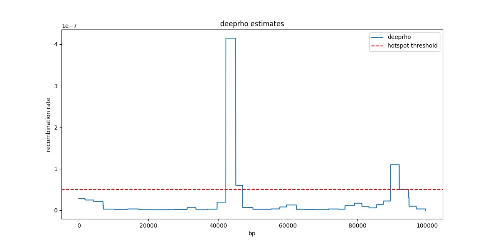

<pre style="background-color:green">

██████╗ ███████╗███████╗██████╗ ██████╗ ██╗  ██╗ ██████╗ 
██╔══██╗██╔════╝██╔════╝██╔══██╗██╔══██╗██║  ██║██╔═══██╗
██║  ██║█████╗  █████╗  ██████╔╝██████╔╝███████║██║   ██║
██║  ██║██╔══╝  ██╔══╝  ██╔═══╝ ██╔══██╗██╔══██║██║   ██║
██████╔╝███████╗███████╗██║     ██║  ██║██║  ██║╚██████╔╝
╚═════╝ ╚══════╝╚══════╝╚═╝     ╚═╝  ╚═╝╚═╝  ╚═╝ ╚═════╝    v2.0
</pre>
DeepRho: software accompanyment for "DeepRho: Accurate Estimation of Recombination Rate from Inferred Genealogies using Deep Learning", Haotian Zhang and Yufeng Wu, manuscript, 2021.

DeepRho constructs images from population genetic data and takes advantage of the power of convolutional neural network (CNN) in image classification to etstimate recombination rate. The key idea of DeepRho is generating genetics-informative images based on inferred gene geneaologies and linkage disequilibrium from population genetic data.

### Code
`deeprho` is an open-source software developed for per-base recombination rate estimation from inferred genealogies using deep learning. `deeprho` makes estimates based on LD patterns and local genealogical trees inferred by [*RENT+*](https://github.com/SajadMirzaei/RentPlus).

---
### Prerequisites
- OS: Linux, Windows, MacOS
- Software: [Conda](https://docs.conda.io/projects/continuumio-conda/en/latest/user-guide/install/download.html)
- Device: [CUDA-Enabled GPU](https://developer.nvidia.com/cuda-gpus) (optional, default set to use CPU)

### Installations
1. Clone from GitHub: `git clone https://github.com/haotianzh/deeprho_v2.git` or Download & unzip the file to your local directory.
2. Enter the directory: `cd deeprho_v2`
3. Create a virtual environment through conda: `conda create -n deeprho python=3.7 openjdk=11 msprime`
4. Activate conda environment: `conda activate deeprho`
5. Install: `pip install .`
6. Validate: `deeprho -v`

[Optional] see [GPU support](#gpu) if you are seeking to use GPU


### Input Formats
- ms-formatted input (the first line is position (seperated by space) followed by haplotype sequences, check `examples/data.ms` for details)
- VCF file (check `examples/data.vcf`)

### Usages (Examples)
- #### [deeprho maketable](#maketable)
    ```python
    # calculate the lookup table based on a user provided demography 
    deeprho maketable --demography examples/ACB_pop_sizes.csv --out ACB_pop_table
  ```
- #### [deeprho estimate](#estimate)
    ```python
    # estimate recombination rates
    deeprho estimate --file examples/data.vcf --ploidy 2 --table ACB_pop_table --plot --verbose --num-thread 8
  ```
- #### [deeprho test](#test)
    ```python
    # generate a test case under a given evolutionary setting
    deeprho test --demography examples/ACB_pop_sizes.csv --rate-map examples/test_recombination_map.txt --npop 50 --ploidy 2 --out test.vcf
    ```
demography is a `.csv` file which contains at least two columns `x` (time) and `y`(size), `time` is measured in generation, see `examples/ACB_pop_sizes.csv` for example.


### Outputs
Default output name is formatted as `<FILE>.rate[.txt|.png|.npy]` in the same directory as your input.
- `.txt` file consists of 3 columns `Start`, `End` and `Rate` seperated by tab.
    a simple output likes:
    ```python
    # your_vcf_file_name.rate.txt
    Start	End	Rate
    0	8	0.0
    8	1822	2.862294427352283e-08
    1822	4321	2.3297465959039865e-08
    4321	7125	1.6098357471351787e-08
    7125	10570	4.027717518356611e-09
    10570	14312	2.1394376828669226e-09
    14312	17689	2.2685986706092933e-09
    17689	19928	1.6854787948356243e-09
    ```
- `.png` file shows a simple plot of estimated recombination map.

   

- `.npy` file stores a `ndarray` object recording recombination rate per base, the i-th element of the `ndarray` denotes the rate from base i to base (i+1).


### <a name='gpu'></a>GPU Support
1. First check if your graphics card is [CUDA-enabled](https://developer.nvidia.com/cuda-gpus).
2. Check [compatibility table](https://www.tensorflow.org/install/source#gpu) to find appropriate python, tensorflow, CUDA, cuDNN version combo.
4. Install `cudatoolkit` and `cudnn`: `conda install -c conda-forge cudatoolkit=11.2 cudnn=8.1.0` 
5. Validate GPU availability,
   ```python
    import tensorflow as tf
    # if you can see your graphics card here, it works!
    print(tf.config.experimental.list_physical_devices('GPU'))
    ```

---
### Docs
- #### <a name="maketable"></a>Make lookup table 
  ```python
    deeprho maketable [-h] [--ne NE] [--demography DEMOGRAPHY] [--npop NPOP] [--ploidy PLOIDY] [--rmin RMIN] \
                      [--rmax RMAX] [--repeat REPEAT] [--draw DRAW] [--num-thread NUM_THREAD] [--verbose]  
  ```
    | Arguments                   | Descriptions                                       |
    |----------------------------------------------------|-------------------------------------------------------------------|
    | `--ploidy <PLOIDY>`         | Ploidy (default 2)                                 |
    | `--ne <NE>`                 | Effective population size (default 10<sup>5</sup>) |
    | `--demography <DEMOGRAPHY>` | Demography file if no lookup table provided        |
    | `--npop <NPOP>`              | Number of individuals or samples                   |
    | `--num-thread <NUMTHREAD>`  | Number of workers for parallel (default 4)         |
    | `--rmin <RMIN>`             | Min of recombination rate per base per generation  | 
    | `--rmax <RMAX>`             | Max of recombination rate per base per generation  |
    | `--repeat <REPEAT>`         | Number of repeats in simulation                    | 
    | `--draw <DRAW>`             | Number of repeats in simulation                    |
    | `--verbose`                 | Show loggings in console                           |
    | `--help, -h`                | Show usage                                         |


- #### <a name="estimate"></a>Estimate 
  ```python
    deeprho estimate [-h] [--file FILE] [--length LENGTH] [--ne NE] [--ploidy PLOIDY] [--res RES] \
                      [--threshold THRESHOLD] [--gws GWS] [--ws WS] [--ss SS] [--m1 MODEL_FINE] \
                      [--m2 MODEL_LARGE] [--num-thread NUM_THREAD] [--plot] [--savenp] [--verbose]
  ```
    | Arguments                  | Descriptions                                                      |
    |-------------------------------------------------------------------|-------------------------------------------------------------------|
    | `--file <FILE>`            | Input file                                                        |
    | `--ploidy <PLOIDY>`        | Ploidy (default 1)                                                |
    | `--ne <NE>`                | Effective population size (default 10<sup>5</sup>)                |
    | `--demography <DEMOGRAPHY>`     | Demography file if no lookup table provided                       |
    | `--gws <GWS>`              | Window size for inferring genealogy (default 10<sup>3</sup> SNPs) |
    | `--ws <WS>`                | Window size for performing `deeprho` (fixed at 50 SNPs)           |
    | `--ss <SS>`                | Step size for performing `deeprho` (default as 25 SNPs)           |     
    | `--length <LENGTH>`        | Length of chromosome                                              |
    | `--m1 <MODELFINE>`         | Path of fine model                                                |
    | `--m2 <MODELLARGE>`        | Path of large model                                               |
    | `--threshold <THRESHOLD>`  | Threshold of recombination Hotspot (default 5x10<sup>-8</sup>)    |
    | `--savenp`                 | Save estimated rates as numpy ndarray (saved as `<FILE>.out.npy`) |
    | `--plot`                   | Plot recombination map (saved as `<FILE>.out.png`)                |
    | `--num-thread <NUMTHREAD>` | Specify number of workers for parallel (default 4)                |
    | `--verbose`                | Show loggings in console                                          |
    | `--help, -h`               | Show usage                                                        |

    - `<LENGTH>` can be either explicitly specified or inferred from input, if the latter, `<LENGTH>`= S<sub>n</sub>-S<sub>1</sub>, 
       where S<sub>n</sub> is physical position of the last SNP site, S<sub>1</sub> is the position of the first SNP site. 
    - `<MODELFINE>, <MODELLARGE>` are two pretrained-models, `deeprho` takes two-stages strategies to estimate recombination rate, 
       `<MODELFINE>` is applied for estimating recombination background regions while `<MODELLARGE>` is used to fine-tune hotspot regions.
        two default models with a constant demographic model are included in this repo, users are also allowed to train their own models through following sections.
    - `<THRESHOLD>` defines a threshold above which a region can be regarded as a hotspot. 5x10<sup>-8</sup> is set as default.
    - `<GWS>` guides how large region the genealogies are inferred from. As our test, 1000 is a great choice to include as much information as possible
       for improving local genealogical inference.
 
      
- #### <a name="test"></a>Test 
  ```python
    deeprho test [-h] [--ne NE] [--demography DEMOGRAPHY] [--npop NPOP] [--ploidy PLOIDY] [--rate-map RATEMAP] \
                      [--recombination-rate RATE] [--sequence-length LENGTH] [--num-thread NUM_THREAD] [--verbose]  
  ```
    | Arguments                     | Descriptions                                       |
  |----------------------------------------------------|---------------------------------|
    | `--ploidy <PLOIDY>`           | Ploidy (default 2)                                 |
    | `--ne <NE>`                   | Effective population size (default 10<sup>5</sup>) |
    | `--demography <DEMOGRAPHY>`   | Demography file if no lookup table provided        |
    | `--npop <NPOP>`               | Number of individuals or samples                   |
    | `--sequence-length <LENGTH>`  | Length of simulated genome                         | 
    | `--recombination-rate <RRATE>` | Recombination rate                                 |
    | `--rate-map <RATEMAP>`        | Recombination rate map                             |
    | `--mutation-rate <MRATE>`     | Mutation rate (default as 2.5x10<sup>-8</sup>)     |
    | `--help, -h`                  | Show usage                                         |


- Demography settings: there are some software used for inferring demographic history, such as [PSMC](https://github.com/stschiff/msmc), [SMC++](https://github.com/popgenmethods/smcpp), [MSMC](https://github.com/stschiff/msmc).
Here we take SMC++ output as our input but only contains one population, get more information about [SMC++ output](https://github.com/popgenmethods/pyrho/blob/master/example/ACB_pop_sizes.csv).

**TIPS: If you are not familiar with these parametric settings, just leave them as default if possible.**

### Contact: 
Feel free to shoot us at <a href = "mailto: haotianzh@uconn.edu"><haotianzh@uconn.edu></a>.